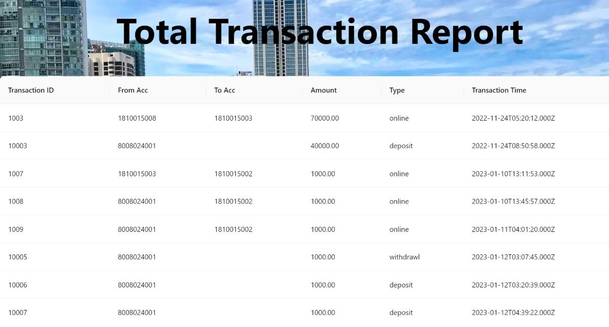

# Bank Transaction Management System

## Table of Contents

- [Introduction](#introduction)
- [Features](#features)
- [Technologies](#technologies)
- [Contributors](#contributors)

---

## Introduction

The **Bank Transaction Management System** is a comprehensive web application developed as a group assignment under CS3043-Database Systems. This system is designed to streamline various banking processes and provide a user-friendly interface for both bank employees, managers and customers.

The core functionality includes managing online transactions, handling online loan applications, updating interest rates for the month, and generating transaction reports, and loan instalment reports.

## Features

- **Online Transactions:** Perform online transactions from one account to another account.

- - **Account Creation and customer registration:** Create pre-defined types of accounts and register customers with user profiles.

- **Online Loan Applications:** Enable customers to apply for loans online with an easy-to-use application process.

- **Interest Rate Management:** Update and manage interest rates for different accounts and loans on a monthly basis and calculate the loan instalments.

- **Transaction Reports:** Generate detailed transaction reports to track account activity and monitor financial health.

- **Loan Installment Reports:** Create reports outlining loan repayment progress for managers.

## Technologies

- **Frontend:** React.js
- **Backend:** Node.js
- **Database:** MySQL
- **Other Technologies:** HTML, CSS, JavaScript

## Contributors

- Ravindi Weerasinghe
- Vishvadini Kurukulasuriya
- Oshadi Perera
- Gayani Wickramarathne
- H.M.M Baqir
- Udara Wijesekara

